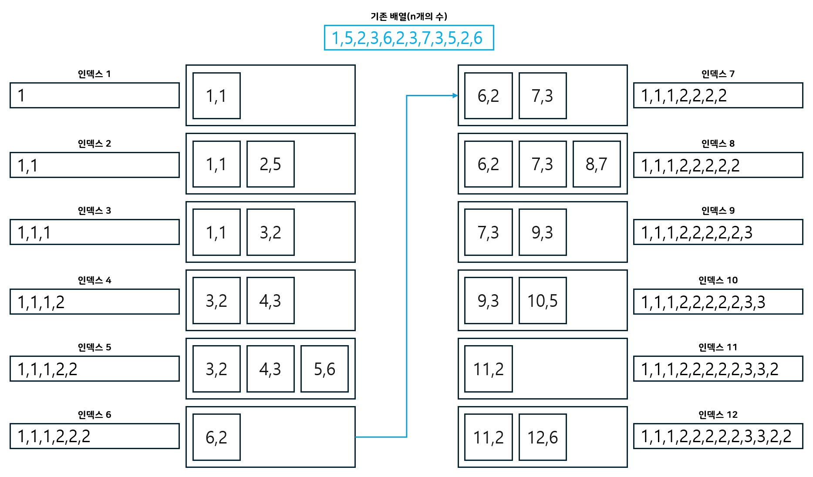

슬라이딩 윈도우
===

# 12891 DNA 비밀번호
```c++
#include <iostream>
#include <vector>
#include <algorithm>
using namespace std;

int checkArr[4];
int myArr[4];
int checkSecret = 0;
void Add(char c);
void Remove(char c);
int main()
{
    ios::sync_with_stdio(false);
    cin.tie(NULL);
    cout.tie(NULL);

    int S, P;
    cin >> S >> P;
    int Result = 0;
    string A;
    cin >> A;
    for (int i = 0; i < 4; i++) {
        cin >> checkArr[i];
        if (checkArr[i] == 0)
            checkSecret++;
    }
    for (int i = 0; i < P; i++) { //초기 P부분 문자열 처리 부분
        // string의 개별 char를 이렇게 접근 가능함
        Add(A[i]);
    }
    if (checkSecret == 4)
        Result++;
    // 슬라이딩 윈도우 처리 부분
    for (int i = P; i < S; i++) {
        int j = i - P;
        Add(A[i]);
        Remove(A[j]);
        if (checkSecret == 4)  // 4자리 수에 대한 크기가 모두 충족되었을 때는 유효한 비밀번호
            Result++;
    }
    cout << Result << "\n";
}

void Add(char c) { //새로 들어온 문자를 처리해주는 함수
    switch (c) {
    case 'A':
        // int myArr[4]와 같은 배열은 vector<int> A(N, 0); 이렇게 선언하지 않아도 0으로 초기화된다.
        myArr[0]++;
        if (myArr[0] == checkArr[0])
            checkSecret++;
        break;
    case 'C':
        myArr[1]++;
        if (myArr[1] == checkArr[1])
            checkSecret++;
        break;
    case 'G':
        myArr[2]++;
        if (myArr[2] == checkArr[2])
            checkSecret++;
        break;
    case 'T':
        myArr[3]++;
        if (myArr[3] == checkArr[3])
            checkSecret++;
        break;
    }
}

void Remove(char c) { //제거되는  문자를 처리해주는 함수
    switch (c) {
    case 'A':
        if (myArr[0] == checkArr[0])
            checkSecret--;
        myArr[0]--;
        break;
    case 'C':
        if (myArr[1] == checkArr[1])
            checkSecret--;
        myArr[1]--;
        break;
    case 'G':
        if (myArr[2] == checkArr[2])
            checkSecret--;
        myArr[2]--;
        break;
    case 'T':
        if (myArr[3] == checkArr[3])
            checkSecret--;
        myArr[3]--;
        break;
    }
}
```
부분 문자열의 길이가 P이므로 O(n)의 시간 복잡도 알고리즘으로 문제를 해결해야 한다.

# 11003 최솟값 찾기 1
```c++
#include <iostream>
#include <vector>
#include <algorithm>
#include <deque>
using namespace std;
// first, second로 각 요소 접근 가능
typedef pair<int, int> Node;
int main()
{
    ios::sync_with_stdio(false);
    cin.tie(NULL);
    cout.tie(NULL);

    int N, L;
    cin >> N >> L;
    deque<Node> mydeque;
    
    for (int i = 0; i < N; i++) {
        int now;
        cin >> now;
        // 새로운 값이 들어 올 때마다 정렬하지 않고 현재 수보다 큰 값을 덱에서 제거함으로써 시간복잡도를 줄일 수 있음
        while (mydeque.size() && mydeque.back().second > now) {
            mydeque.pop_back();
        }
        // i는 인덱스, now는 현재 값이다.
        // 그림에서고 잘 보면 push_back은 모든 단계에서 진행되는 것을 볼 수 있다.
        mydeque.push_back(Node(i, now));
        // 인덱스를 기준으로 범위에서 벗어난 값은 덱에서 제거
        if (mydeque.front().first <= i - L) {
            mydeque.pop_front();
        }
        cout << mydeque.front().second << ' ';
    }
}
```
이 문제에서는 시간 복잡도를 줄이기 위해서 정렬 대신에 슬라이딩 윈도우와 deque(double ended queue)를 사용해 푼다.

