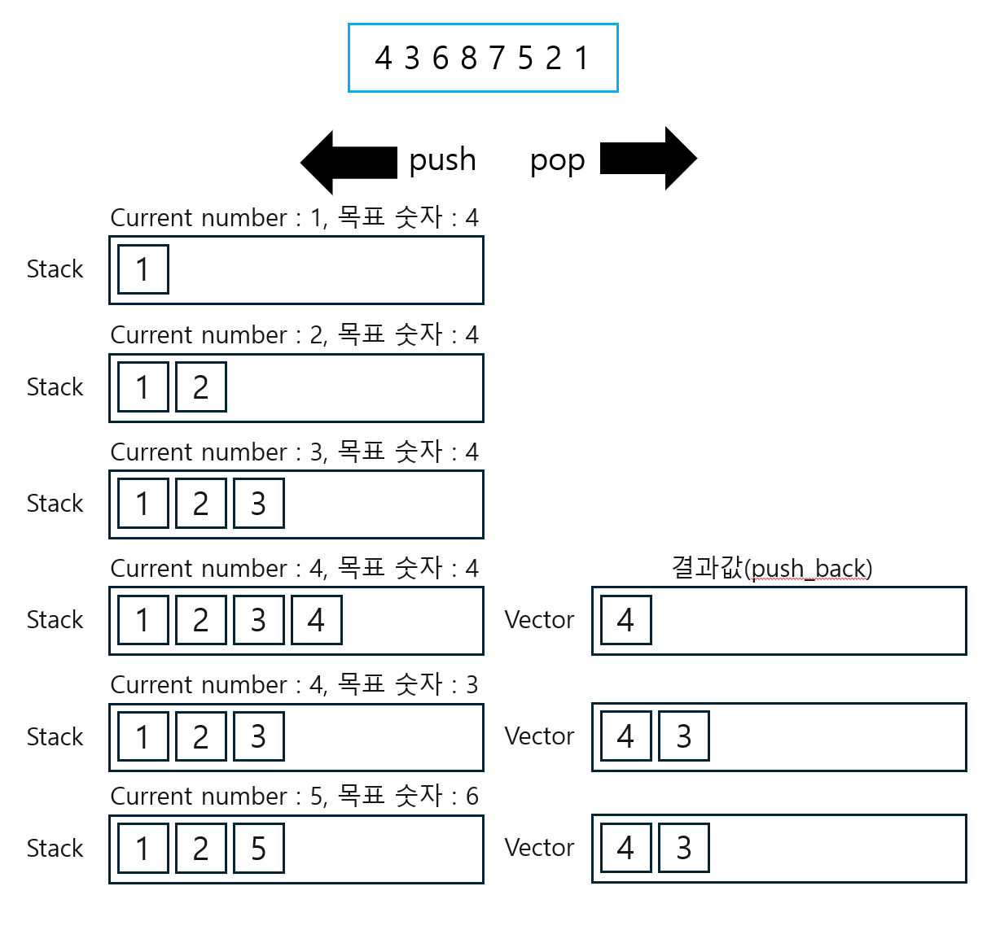
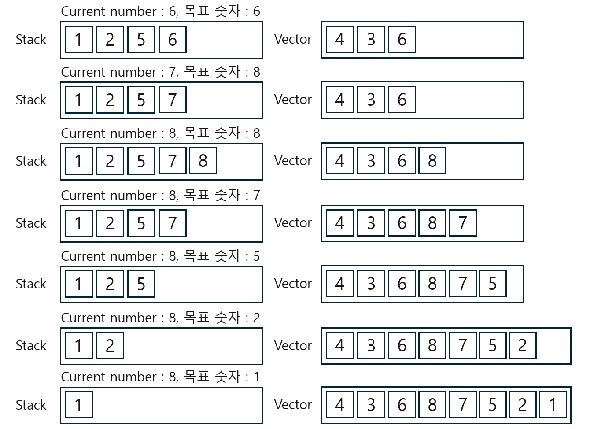

스택
===

# 1874 스택으로 수열 만들기

```c++
#include <iostream>
#include <vector>
#include <stack>
using namespace std;

int main()
{
    ios::sync_with_stdio(false);
    cin.tie(NULL);
    cout.tie(NULL);

    int N;
    cin >> N;
    // 4 3 6 8 7 5 2 1
    vector<int> A(N, 0);
    // +,- 를 담는 벡터
    vector<char> resultV;
    for (int i = 0; i < N; i++) {
        cin >> A[i];
    }
    stack<int> myStack;
    int num = 1; // 오름차순 수
    bool result = true;
    for (int i = 0; i < A.size(); i++) {
        int su = A[i]; // 현재 수열의 수
        if (su >= num) { //현재 수열 값 >= 오름차순 자연수 : 값이 같아 질 때까지 push()수행
            while (su >= num) { // push()
                myStack.push(num++);
                resultV.push_back('+');
            }
            myStack.pop();
            resultV.push_back('-');
        }
        else {  //현재 수열 값 < 오름차순 자연수: pop()을 수행하여 수열 원소를 꺼냅니다
            int n = myStack.top();
            myStack.pop();
            // 스택의 가장 위의 수가 만들어야 하는 수열의 수 보다 크다면 수열 출력 불가능
            if (n != su) {
                cout << "NO";
                result = false;
                break;
            } 
            else {
                resultV.push_back('-');
            }
        }
    }
    if (result) {
        for (int i = 0; i < resultV.size(); i++)
        {
            cout << resultV[i] << '\n';
        }
    }
}
```

## 결과값은 정답, 시간초과 풀이
```c++
#include <iostream>
#include <vector>
#include <algorithm>
#include <stack>

using namespace std;

int main() {
    ios::sync_with_stdio(false);
    cin.tie(NULL);
    cout.tie(NULL);

    int N;
    cin >> N;
    vector<int> inputVector(N, 0);
    stack<int> currentStack;
    vector<char> resultVector;
    bool result = true;

    for (int i = 0; i < N; i++) {
        cin >> inputVector[i];
    }

    int currentNumber = 1;
    for (int i = 0; i < N; i++) {
        int targetNumber = inputVector[i];
        if (currentNumber <= targetNumber) {
            while (currentNumber <= targetNumber) {
                currentStack.push(currentNumber);
                resultVector.push_back('+');
                currentNumber++;
            }
            currentStack.pop();
            resultVector.push_back('-');
        } else {
            if (currentStack.top() != targetNumber) {
                result = false;
                break;
            }
            currentStack.pop();
            resultVector.push_back('-');
        }
    }

    if (result) {
        for (int i = 0; i < resultVector.size(); i++) {
            cout << resultVector[i] << endl;
        }
    } else {
        cout << "NO" << endl;
    }
}
```
## 원리



## 17298 오큰수
```c++
#include <iostream>
#include <vector>
#include <stack>
using namespace std;

int main()
{
    ios::sync_with_stdio(false);
    cin.tie(NULL);
    cout.tie(NULL);

    int N;
    cin >> N;
    vector<int> A(N, 0);
    vector<int> ans(N, 0);
    for (int i = 0; i < N; i++) {
        cin >> A[i];
    }
    stack <int> myStack;
    myStack.push(0);
    for (int i = 1; i < N; i++) {
        //스택 비어있지 않고 현재 수열이 스택 TOP인덱스 가르키는 수열보다 크면
        while (!myStack.empty() && A[myStack.top()] < A[i]) {
            ans[myStack.top()] = A[i];  //정답 배열에 오큰수를 현재 수열로 저장하기
            myStack.pop();
        }
        myStack.push(i); //신규데이터 push  
    }
    while (!myStack.empty()) {
        // 반복문을 다 돌고 나왔는데 스택이 비어있지 않다면 빌 때 까지
        ans[myStack.top()] = -1;
        myStack.pop();
    };
    for (int i = 0; i < N; i++) {   // 출력
        cout << ans[i] << " ";
    }
}
```
## 원리
단순 중첩 반복문은 시간을 초과하므로 위와 같이 풀어야 한다.  
핵심 원리는 '스택에 새로 들어오는 수가 top에 존재하는 수보다 크면 그 수는 오큰수가 된다는 것'이다.  
(손으로 풀어본 후 코드를 봐야 한다.)  

손으로 풀어보면 스택에서 pop할 때 answer vector에 값을 넣어주면 되는 것을 확인할 수 있다.