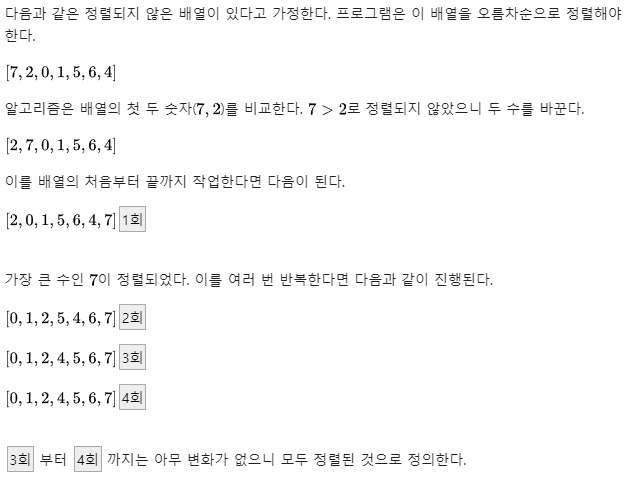
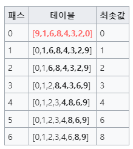
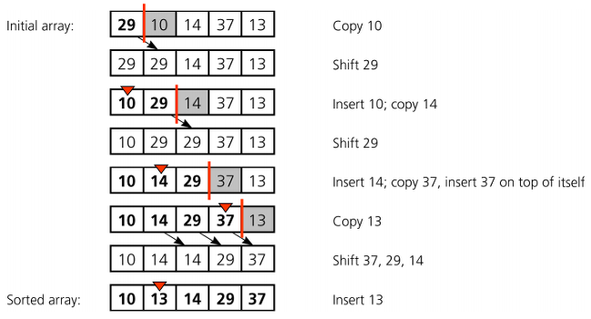
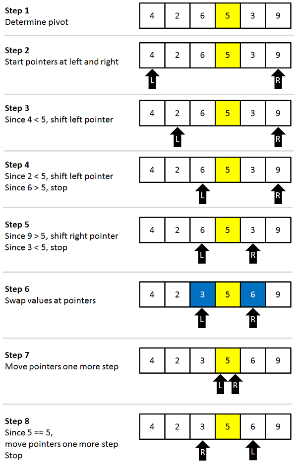
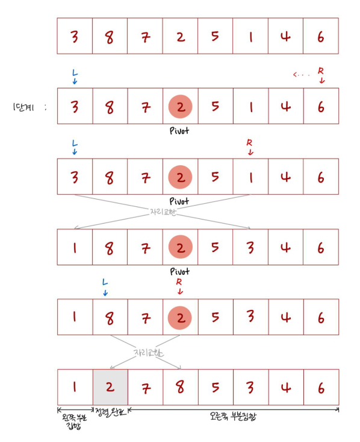
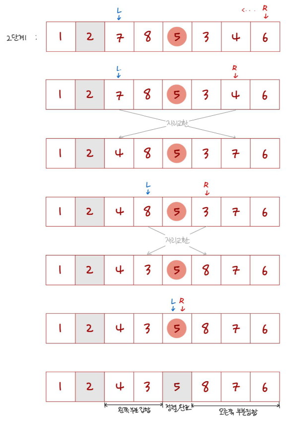
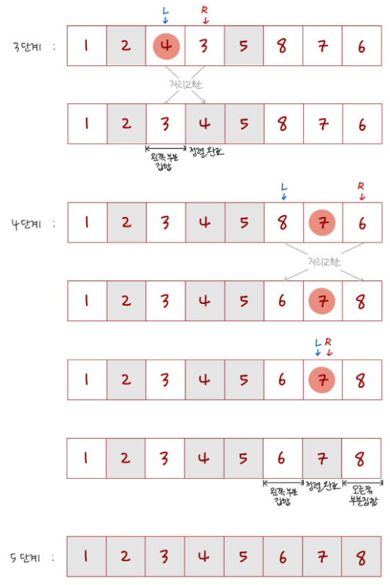
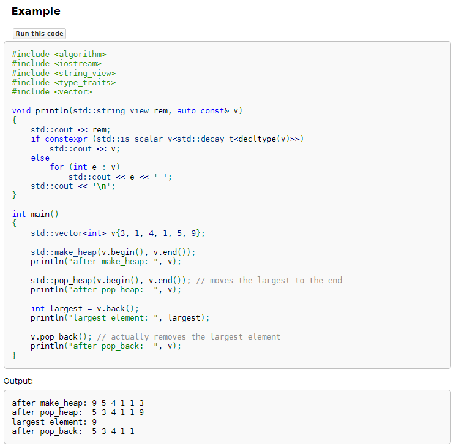

정렬
===
# 버블 정렬

# 선택 정렬
1. 주어진 리스트 중에 최소값을 찾는다.
2. 그 값을 맨 앞에 위치한 값과 교체한다(패스(pass)).
3. 맨 처음 위치를 뺀 나머지 리스트를 같은 방법으로 교체한다.

# 삽입 정렬
1. 외부 반복문을 실행할 때, key미만의 영역은 정렬이 된 상태이므로 key를 어디에 넣을 지가 중요
2. 조건문으로 확인하여 key보다 큰 모든 요소를 오른쪽으로 이동 - **정렬 영역 : key 인덱스 이하(key 인덱스 포함)**

# 병합 정렬

# 퀵 정렬

조금 더 상세한 설명 - 출처 : https://miiinnn23.tistory.com/8

# 힙 정렬

